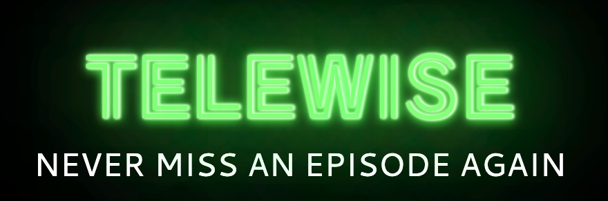
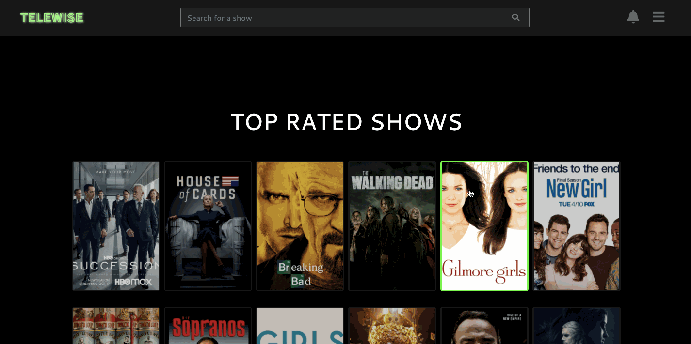

### 📝 About the project

Telewise is a Ruby on Rails app that allows users to keep up to date with their favourite TV shows. This programme scheduling and reviewing prototype, loaded with 18 sample shows, lets users track their watch progress, receive notifications when new episodes air, and leave a review for other users.

### 🛠 What we used

- [Figma](https://www.figma.com/) for prototyping UI/UX design
- [Devise](https://github.com/heartcombo/devise) for authentication
- [TVMaze API](https://www.tvmaze.com/api) for show data and posters
- [Streaming Availability API](https://rapidapi.com/movie-of-the-night-movie-of-the-night-default/api/streaming-availability/) for streaming links
- [Heroku](https://heroku.com/) for hosting

Find it at [telewise.co.uk](https://www.telewise.co.uk) 📺
